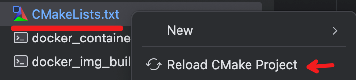
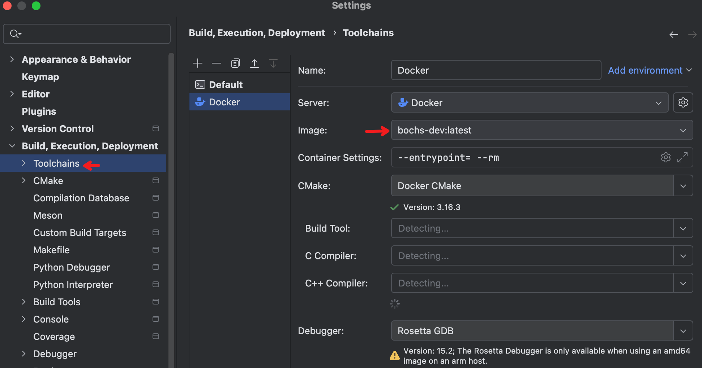
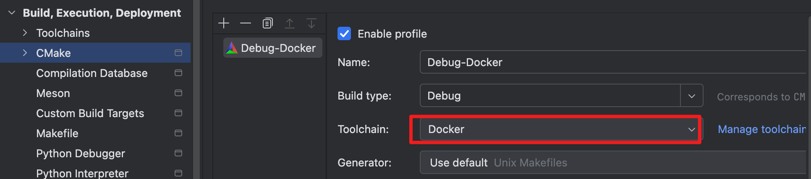
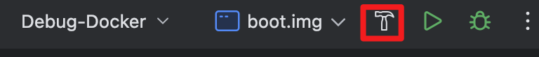

# fooOs
A simple test foo OS

## 环境安装
+ 执行 sh ./[docker_img_build.sh](docker_img_build.sh) 构建docker镜像
+ 执行 sh ./[docker_container_run_once.sh](docker_container_run_once.sh) 启动docker容器（包含bochs虚拟机以及交叉编译链环境）
+ CMake Project Reload:右击[CMakeLists.txt](CMakeLists.txt),点击Reload CMake Project:  
 

+ 配置编译链环境：  


+ 配置Cmake环境：  


+ 编译boot.img镜像:  


+ 加载boot.img测试:
```
bochs -qf  .bochsrc
```

## 文档
+ 参考源码：
  + https://github.com/yourtion/30dayMakeOS
  + https://github.com/yourtion/YOS
+ 笔记：[notes](notes)
